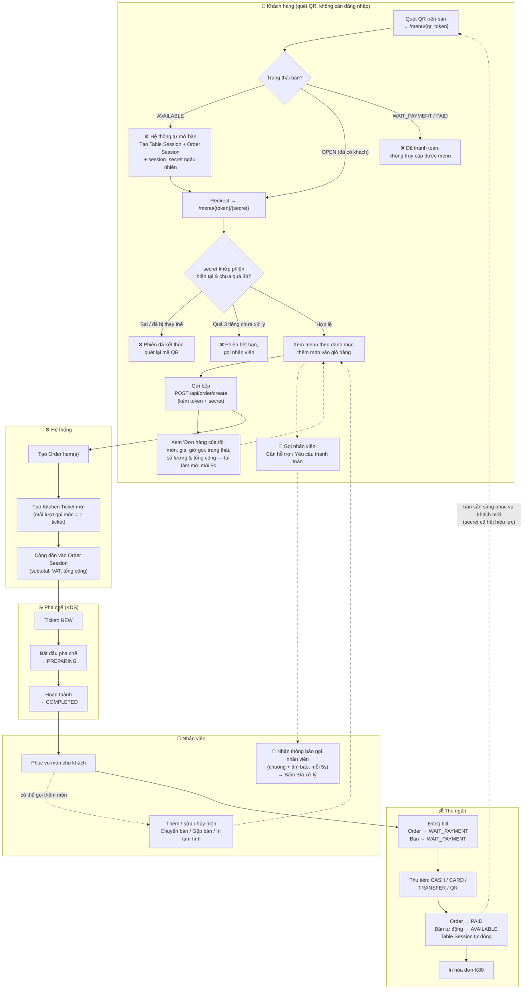

# Cafe POS & Kitchen Display System (KDS)

Hệ thống POS + KDS cho quán cafe: đặt món qua QR (tự động, không cần nhân viên mở/đóng bàn), quản lý bàn, đơn hàng, bếp, thu ngân, gọi nhân viên, in hóa đơn và báo cáo doanh thu. Xây dựng theo spec [`SDS_POS_And_Kitchen_Display_KDS_Full.txt`](SDS_POS_And_Kitchen_Display_KDS_Full.txt).

## Công nghệ

- CodeIgniter 3.1.x (PHP 8.x)
- MySQL 8 (`utf8mb4`)
- Bootstrap 5 + Bootstrap Icons, vanilla JS (`fetch`) — giao diện mobile-first
- AJAX polling 5 giây cho KDS, sơ đồ bàn, chuông gọi nhân viên và trạng thái đơn của khách

## Cài đặt

1. Yêu cầu: XAMPP (Apache + MySQL) + PHP CLI, đặt project tại `htdocs/kds`.
2. Tạo database:
   ```
   mysql -u root -e "CREATE DATABASE IF NOT EXISTS kds_cafe CHARACTER SET utf8mb4 COLLATE utf8mb4_unicode_ci;"
   ```
3. Kiểm tra `application/config/database.php` (mặc định `root` / không mật khẩu / `kds_cafe`) và `application/config/config.php` (`base_url = http://localhost/kds/`).
4. Chạy migration (tạo bảng + seed dữ liệu mẫu):
   ```
   php index.php migrate
   ```
5. Truy cập http://localhost/kds/login

## Tài khoản mẫu (mật khẩu chung: `123456`)

| Username | Vai trò | Trang chính sau đăng nhập |
|---|---|---|
| `admin` | ADMIN | Toàn quyền: Bàn, Quản lý bàn, Đơn hàng, Bếp, Thu ngân, Danh mục, Sản phẩm, Người dùng, Báo cáo |
| `staff1` | STAFF | Sơ đồ bàn, Đơn hàng |
| `barista1` | BARISTA | Kitchen Display (Bếp) |
| `cashier1` | CASHIER | Thu ngân, Lịch sử thanh toán |

Dữ liệu mẫu: 4 danh mục, 10 sản phẩm, 12 bàn (`T01`–`T12`), mỗi bàn có `qr_token` riêng.

## Luồng nghiệp vụ

Bàn **tự động mở** khi khách quét QR lần đầu và **tự động về trống** ngay sau khi thanh toán — không còn bước "nhân viên mở bàn" / "bấm nút đóng bàn" thủ công.

```
Khách quét QR (lần đầu, bàn Trống) → Hệ thống tự mở bàn + tạo Table Session/Order Session
  → Khách order → Kitchen Ticket tạo → Barista nhận (PREPARING) → Barista hoàn thành (COMPLETED)
  → Staff phục vụ (có thể thêm món tiếp / khách "Gọi nhân viên" hỗ trợ hoặc yêu cầu thanh toán)
  → Cashier đóng bill (WAIT_PAYMENT) → Thanh toán (PAID)
  → In hóa đơn + Bàn tự động về Trống ngay lập tức (không cần bấm "Đóng bàn")
```

### Sơ đồ luồng (flow) chi tiết theo vai trò



## Đặt món qua QR (khách hàng)

- **QR trên bàn là link cố định** `/menu/{qr_token}` — không bao giờ cần in lại.
- **Tự động mở bàn**: khách quét QR lần đầu khi bàn đang Trống → hệ thống tự tạo phiên (không cần nhân viên bấm "Mở bàn"), rồi chuyển hướng sang link riêng cho lượt khách đó: `/menu/{qr_token}/{session_secret}`.
- **Chặn link cũ (chống giả mạo phiên)**: mỗi lượt khách có một `session_secret` ngẫu nhiên riêng.
  - Bàn được dùng lại cho khách mới (đã thanh toán xong) → `session_secret` cũ **lập tức vô hiệu**, dù khách cũ vẫn còn mở link/bookmark cũ trên điện thoại.
  - Phiên mở quá **3 tiếng** mà chưa thanh toán (khách bỏ đi, nhân viên quên xử lý) → link cũng tự vô hiệu, yêu cầu gọi nhân viên hoặc quét lại QR (nhân viên vẫn thấy bàn đang mở trong hệ thống, có thể xử lý thủ công qua **Quản lý bàn → Đặt lại**).
  - Mọi request (đặt món, hủy món, xem đơn, gọi nhân viên) đều được server kiểm tra lại `session_secret` này, không chỉ lúc tải trang.
- Bàn đã đóng bill/thanh toán (`WAIT_PAYMENT`/`PAID`) → chặn hoàn toàn truy cập menu.
- **Gọi nhân viên**: nút 🔔 trên menu, khách chọn "Cần hỗ trợ" hoặc "Yêu cầu thanh toán" → hiện ngay trên chuông thông báo (kèm âm báo) ở mọi trang nhân viên/thu ngân/admin, tự làm mới mỗi 5s, có nút "Đã xử lý". Tự chặn gửi trùng yêu cầu liên tiếp.
- **Thanh toán xong → bàn tự động về Trống ngay lập tức**, không cần nhân viên bấm nút "Đóng bàn".
- Giao diện khách: menu dạng danh sách hàng ngang (ảnh - tên - giá - số lượng), giỏ hàng dạng thanh nổi + offcanvas trượt đáy màn hình, theo dõi trạng thái món tự làm mới mỗi 5 giây.

## Cấu trúc thư mục chính

```
application/
  controllers/        Auth, Dashboard, Tables, Orders, Kitchen, Cashier, Payments,
                       Products, Categories, Users, Reports, Menu (QR công khai),
                       Api_order, Api_payment, Api_kitchen, Api_tables,
                       Api_call (khách gọi NV), Api_assistance (NV xử lý yêu cầu)
  core/                MY_Controller (session + RBAC theo vai trò),
                       MY_Api_Controller (JSON 401/403 cho API nội bộ)
  models/              User, Table, Table_session (secret + TTL phiên), Category, Product,
                       Order, Order_item, Kitchen_ticket, Payment, Audit_log, Assistance_call
  migrations/          001–015: tạo bảng, seed dữ liệu mẫu, session_secret, gọi nhân viên
  views/               Bootstrap 5, 1 thư mục / tính năng + layout/ dùng chung
assets/
  css/style.css        CSS responsive dùng chung (brand theme, KDS, giỏ hàng, in K80)
  uploads/products/    Ảnh sản phẩm tải lên từ trang Quản lý sản phẩm
```

## Vai trò & quyền (RBAC)

| Vai trò | Quyền truy cập |
|---|---|
| STAFF | Sơ đồ bàn, Đơn hàng (thêm/sửa/hủy món, chuyển/gộp bàn, in tạm tính), nhận thông báo gọi nhân viên |
| BARISTA | Kitchen Display, chi tiết ticket |
| CASHIER | Đóng bill, thanh toán, in hóa đơn, lịch sử thanh toán, nhận thông báo gọi nhân viên |
| ADMIN | Toàn bộ trên + Quản lý bàn (thêm/sửa/xóa/đặt lại trạng thái), Danh mục, Sản phẩm, Người dùng, Báo cáo |

Chặn quyền được xử lý ở `MY_Controller::$allowed_roles`; truy cập sai vai trò trả về trang 403.

## Bảo mật

- Mật khẩu băm bằng `password_hash` (bcrypt).
- CSRF protection bật toàn cục cho form trình duyệt (loại trừ `api/*` — API dùng JSON + token/secret riêng).
- RBAC theo vai trò ở tầng controller.
- **Session bàn theo lượt khách**: mỗi phiên bàn (`table_sessions`) có `session_secret` ngẫu nhiên 32 ký tự + thời hạn tối đa 3 giờ (`Table_session_model::SESSION_TTL_HOURS`). Toàn bộ API công khai (`Api_order`, `Api_call`) validate lại secret + thời hạn trên **mọi** request, không chỉ khi tải trang — chặn khách cũ dùng lại link sau khi rời quán hoặc bàn đã phục vụ khách mới.
- Ghi `audit_logs` cho các thao tác quan trọng: đăng nhập/đăng xuất, mở/chuyển/gộp bàn, thêm/sửa/hủy món, đóng bill, thanh toán, gọi nhân viên/xử lý, CRUD danh mục/sản phẩm/người dùng/bàn.

## Báo cáo (Admin → Báo cáo)

Doanh thu theo ngày, doanh thu theo tháng, sản phẩm bán chạy, sử dụng bàn, hiệu suất bếp, tổng hợp thanh toán theo phương thức.

## In ấn

- **Tạm tính** (`tables/{id}/print-provisional`), **Hóa đơn** (`cashier/{order_id}/invoice`) và **QR dán bàn** (`tables/{id}/qr`): khổ giấy K80 (80mm), có nút bấm để in thủ công (không tự động mở hộp thoại in khi tải trang).
